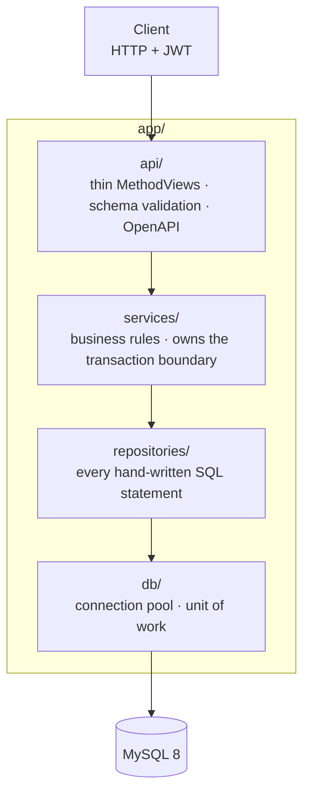
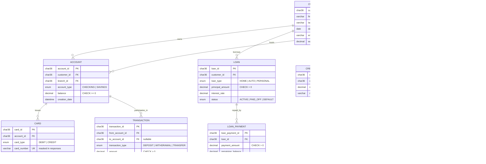

# corebank-api

**Core banking REST API — Flask, MySQL, JWT, hand-written SQL, fully containerized.**

[](https://github.com/efkirmizi/corebank-api/actions/workflows/ci.yml)
[](https://www.python.org/downloads/)
[](LICENSE)
[](#testing)

A retail core-banking service: customers, accounts, cards, loans, branches, employees,
support tickets, and a transaction ledger with atomic money transfers. 62 endpoints,
OpenAPI documented, backed by MySQL 8.

It began as a university database course project. That version had no tests, no README,
hardcoded secrets, and a money-transfer function that could lose money under concurrency.
This repository is that project rebuilt into a production-shaped service — **without
replacing the hand-written SQL**, which is the part worth showing.

---

## Quickstart

```bash
git clone https://github.com/efkirmizi/corebank-api.git
cd corebank-api
docker compose up
```

That's it — no local MySQL required. Compose starts MySQL 8, waits for it to pass a
healthcheck, applies migrations, loads a demo dataset, and serves the API.

| | |
|---|---|
| **Swagger UI** | http://localhost:5000/docs |
| **OpenAPI JSON** | http://localhost:5000/openapi.json |
| **Health / readiness** | http://localhost:5000/health · `/health/ready` |

Demo logins: `admin` / `admin123` (ADMIN) · `alice` / `alice123` · `bob` / `bob123`

```bash
# authenticate
TOKEN=$(curl -s localhost:5000/api/v1/auth/login \
  -H 'Content-Type: application/json' \
  -d '{"username":"alice","password":"alice123"}' | jq -r .access_token)

# alice sees only her own accounts
curl -s localhost:5000/api/v1/accounts/ -H "Authorization: Bearer $TOKEN"

# move money, atomically
curl -s -X POST localhost:5000/api/v1/transactions/transfer \
  -H "Authorization: Bearer $TOKEN" -H 'Content-Type: application/json' \
  -d '{"sender_account_id":"acc00000-0000-0000-0000-000000000001",
       "receiver_account_id":"acc00000-0000-0000-0000-000000000002",
       "amount":"200.00"}'
```

---

## Architecture

Four layers, dependencies pointing one way only.



Two invariants, and they are **enforced by tests**, not by good intentions
([`tests/architecture/test_layering.py`](tests/architecture/test_layering.py)):

- **No SQL outside `repositories/`.** A route can never reach a cursor.
- **No Flask below the API layer.** Services and repositories import no framework, so
  they can be unit-tested with fake repositories and no app context.

### The unit of work

The single transaction boundary in the system. Services open one, call any number of
repositories with the shared connection, and either everything commits or nothing does.
Repositories never commit on their own — which is what makes a half-completed transfer
structurally impossible rather than merely fixed once.

```python
with unit_of_work() as conn:                     # BEGIN
    accounts.debit(conn, sender_id, amount)      # SELECT … FOR UPDATE, guarded UPDATE
    accounts.credit(conn, receiver_id, amount)
    transactions.insert(conn, record)
                                                 # COMMIT — or ROLLBACK if anything raised
```

---

## Data model

Eleven tables. `DECIMAL(15,2)` for money everywhere, `CHAR(36)` UUID keys, foreign keys
and CHECK constraints enforced in the schema rather than trusted from the application.



Schema changes ship as numbered migrations in [`migrations/`](migrations/), applied by an
idempotent runner that records each version in a `schema_migrations` table — no ORM, no
Alembic, and no `init_db()` firing on import.

---

## The SQL

Every query is hand-written and lives in [`app/repositories/`](app/repositories/). Three
of them answer real analytical questions rather than fetching rows by id.

**1. Which customers move the most money?** Aggregates across every account a customer
owns, counting transactions in either direction, and filters the grouped total.

```sql
SELECT C.customer_id, C.first_name, C.last_name, SUM(T.amount) AS total_transaction
FROM customer C
JOIN account A ON C.customer_id = A.customer_id
JOIN transaction T ON A.account_id = T.from_account_id OR A.account_id = T.to_account_id
GROUP BY C.customer_id, C.first_name, C.last_name
HAVING SUM(T.amount) > %s
ORDER BY total_transaction DESC
```

**2. Which branches are both well staffed and well used?** Two `LEFT JOIN`s fan out to
employees and accounts, so the rows multiply — `COUNT(DISTINCT …)` is what keeps each
count honest.

```sql
SELECT B.branch_name,
       COUNT(DISTINCT E.employee_id) AS employee_count,
       COUNT(DISTINCT A.account_id)  AS account_count
FROM branch B
LEFT JOIN employee E ON B.branch_id = E.branch_id
LEFT JOIN account  A ON B.branch_id = A.branch_id
GROUP BY B.branch_name
HAVING COUNT(DISTINCT E.employee_id) > %s AND COUNT(DISTINCT A.account_id) >= %s
```

**3. Who resolves the most support tickets?** A CTE aggregates per employee, then the
outer query keeps everyone tied at the maximum — so a tie returns both, not an arbitrary one.

```sql
WITH ResolvedTickets AS (
    SELECT E.employee_id, E.first_name, E.last_name,
           COUNT(CS.ticket_id) AS resolved_tickets
    FROM employee E
    JOIN customer_support CS ON E.employee_id = CS.employee_id
    WHERE CS.status = 'RESOLVED'
    GROUP BY E.employee_id, E.first_name, E.last_name
)
SELECT employee_id, first_name, last_name, resolved_tickets
FROM ResolvedTickets
WHERE resolved_tickets = (SELECT MAX(resolved_tickets) FROM ResolvedTickets)
```

---

## Transaction safety

The original transfer read the balance, checked it in Python, then issued two unlocked
`UPDATE`s. Under concurrency the check races: several requests read the same sufficient
balance and all proceed to debit. The only thing standing between that and a negative
balance was the schema's `CHECK` constraint — so races surfaced as database errors
(HTTP 500s) instead of a clean "insufficient funds".

The current implementation runs the whole movement in one unit of work: both rows locked
`FOR UPDATE` **in account-id order** so opposing transfers can't deadlock, and the debit
guarded in SQL (`WHERE balance >= amount`) so a check-then-act race is impossible.

[`scripts/concurrency_demo.py`](scripts/concurrency_demo.py) runs both against 8 threads
hammering one account with 480 concurrent withdrawals:

```
NAIVE  (check-then-act, no row lock)
  transfers ok         : 10
  cleanly rejected 422 : 464
  DB errors (would 500):   6        ← races that escaped the application check
  total balance        : 400.00  (expected 400.00, conserved=True)

ATOMIC (unit of work, FOR UPDATE, guarded debit)
  transfers ok         : 11
  cleanly rejected 422 : 469
  DB errors (would 500):   0        ← none reached the database
  total balance        : 400.00  (expected 400.00, conserved=True)
```

[`tests/concurrency/`](tests/concurrency/) locks this in as a gating test: many threads
transferring randomly among shared accounts must leave the total balance unchanged to the
cent, with no account negative.

Money is `Decimal` from the database driver through the service layer to the JSON
response, where it is serialized as a string — it never passes through a float.

---

## API

62 endpoints: 60 under `/api/v1` plus two health probes. Full interactive documentation
at `/docs`.

Authenticate at `POST /api/v1/auth/login`, then send `Authorization: Bearer <token>`.
Roles are `ADMIN` and `USER`; **a `USER` can only ever reach their own data** — their
customer record, accounts, cards, loans, credit scores, tickets, and transactions.

| Resource | Endpoints |
|---|---|
| **Auth** | `POST /auth/login` · `GET /auth/me` |
| **Accounts** | `GET,POST /accounts/` · `GET,DELETE /accounts/{id}` · `PUT /accounts/{id}/balance` |
| **Transactions** | `GET /transactions/` · `GET,DELETE /transactions/{id}` · `GET /transactions/by-account/{id}` · **`POST /transactions/transfer`** · `GET /transactions/reports/high-value/{min}` |
| **Customers** | `GET,POST /customers/` · `GET,PUT,DELETE /customers/{id}` |
| **Cards** | `GET,POST /cards/` · `GET,DELETE /cards/{id}` · `PUT /cards/{id}/status` |
| **Loans** | `GET,POST /loans/` · `GET,DELETE /loans/{id}` · `PUT /loans/{id}/status` |
| **Loan payments** | `GET,POST /loan-payments/` · `GET,DELETE /loan-payments/{id}` · `GET /loan-payments/by-loan/{id}` |
| **Branches** | `GET,POST /branches/` · `GET,PUT,DELETE /branches/{id}` · `GET /branches/reports/conditions` |
| **Employees** | `GET,POST /employees/` · `GET,PUT,DELETE /employees/{id}` |
| **Support tickets** | `GET,POST /support-tickets/` · `GET,DELETE /support-tickets/{id}` · `PUT /support-tickets/{id}/status` · `GET /support-tickets/reports/top-resolvers` |
| **Credit scores** | `GET,POST /credit-scores/` · `GET,PUT,DELETE /credit-scores/{id}` |
| **Users** | `GET,POST /users/` · `GET,PUT,DELETE /users/{id}` |
| **Health** | `GET /health` · `GET /health/ready` |

Every response — including errors — uses one envelope:

```json
{
  "code": 422,
  "status": "Unprocessable Entity",
  "message": "Validation failed",
  "errors": { "json": { "amount": ["Not a valid number."] } }
}
```

---

## Testing

```bash
pip install -r requirements-dev.txt
pytest                      # unit + integration + concurrency + architecture
pytest -m "not integration" # unit and architecture only, no database needed
pytest --cov=app            # with coverage
```

Integration tests run against a real MySQL (set `DB_HOST`/`DB_PORT`/`DB_USER`/
`DB_PASSWORD`); the suite drops and rebuilds a `bank_test` database from migrations and
seeds on every run, so results are repeatable. CI does exactly this against a MySQL
service container on every push.

**48 tests, 91% coverage.**

| Suite | What it proves |
|---|---|
| `tests/unit/` | Transfer orchestration against **fake repositories, no database** — overdraft, self-transfer, ownership, non-positive amounts. Possible only because services import no Flask. |
| `tests/integration/` | Unit-of-work commit *and* rollback; full HTTP flows (auth, ownership, 401/403/404/422); repository CRUD with `Decimal` money; a complete admin lifecycle across every resource. |
| `tests/concurrency/` | Total balance conserved and no negative balances under 8 threads of concurrent transfers. |
| `tests/architecture/` | The dependency rule itself: no SQL outside repositories, no Flask below the API layer, no upward imports. |

---

## Project structure

```
app/
  api/            thin flask-smorest MethodViews, one module per resource
  services/       business rules; owns transaction boundaries
  repositories/   every hand-written SQL statement
  db/             connection pool + unit of work
  security/       JWT decorators and ownership checks
  config.py       env-driven config; production fails fast on missing secrets
migrations/       numbered .sql files + schema_migrations bookkeeping
seeds/            demo dataset
scripts/          migration runner, concurrency demo
tests/            unit · integration · concurrency · architecture
docker/           container entrypoint
```

## Configuration

All configuration is environment-driven; see [`.env.example`](.env.example). Nothing
secret is committed, and **production refuses to boot** if `JWT_SECRET_KEY` or the
database credentials are missing, or if `CORS_ORIGINS` is still `*`.

| Variable | Default | Notes |
|---|---|---|
| `APP_ENV` | `development` | `development` · `testing` · `production` |
| `JWT_SECRET_KEY` | dev placeholder | Required in production |
| `DB_HOST` / `DB_PORT` | `localhost` / `3306` | |
| `DB_USER` / `DB_PASSWORD` | `root` / — | Required in production |
| `DB_NAME` | `bank` | |
| `DB_POOL_SIZE` | `5` | Pooled connections |
| `CORS_ORIGINS` | `*` | Comma-separated allowlist; must not be `*` in production |
| `SEED_DEMO_DATA` | unset | Set to load the demo dataset at container start |

---

## What changed from the original

| Area | Before | Now |
|---|---|---|
| Money transfer | Two unlocked `UPDATE`s, check-then-act | One unit of work, `FOR UPDATE` in id order, debit guarded in SQL |
| Money type | `float()` arithmetic | `Decimal` end to end |
| Secrets | JWT key and DB password hardcoded | Environment config, fail-fast in production |
| Schema | `init_db()` on import; app dead without a preconfigured MySQL | Versioned migrations + `docker compose up` |
| Structure | 4,300 lines of routes with SQL inline, ~85% Swagger docstrings | Layered `api → services → repositories → db`, enforced by tests |
| Docs | Hand-written YAML docstrings that could drift | Generated from the same schemas that validate requests |
| Tests / CI | None | 48 tests, 91% coverage, GitHub Actions |

**Two fixes worth calling out.** `POST /users` was unauthenticated in the original —
anyone could create an `ADMIN` account; it is now admin-only. And login ran the username
through `re.sub(r"[^a-zA-Z0-9_]", "", username)` "to prevent SQL injection" on an
already-parameterized query: it added no safety and silently merged distinct usernames
(`a-b` and `ab` resolved to the same account). It's gone.

> **Breaking change.** Endpoints moved under `/api/v1`, and role checks are now paired
> with ownership checks. A `USER` that could previously read another customer's records
> can no longer do so. This is deliberate.

## Roadmap

- Idempotency keys on transfers, so a retried request cannot double-charge
- Pagination and filtering on collection endpoints
- Refresh tokens and revocation
- Statement generation and scheduled loan amortization

## License

[MIT](LICENSE)
